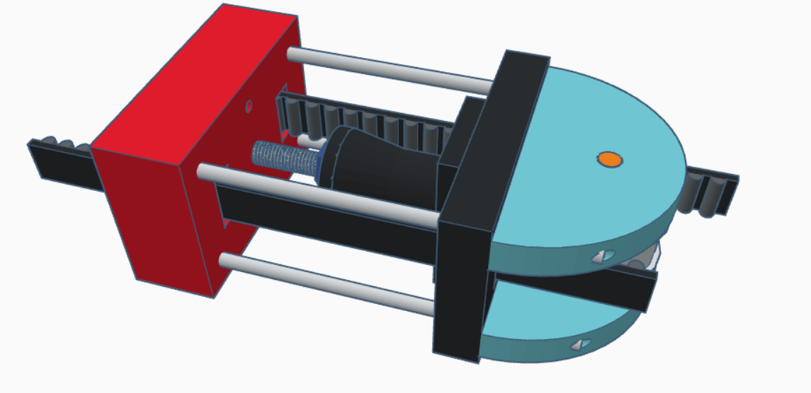
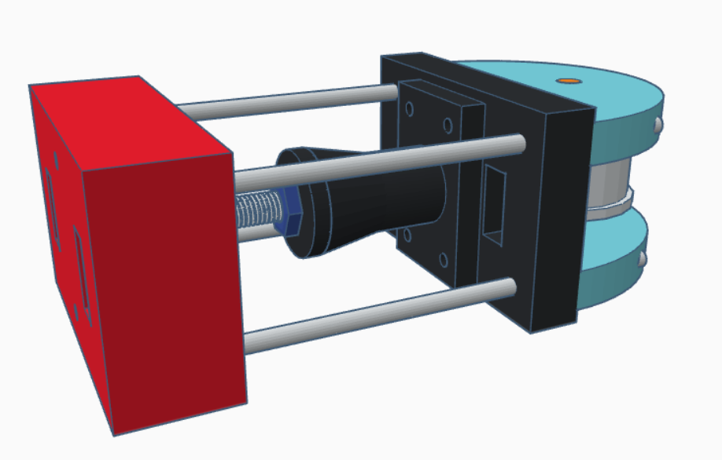

## Overview 
Given that the [timing belt](../research-development-hardware/mechanical-parts/timing-belt) is manufactured to a fixed length and cannot be modified to alter its loop size, it is imperative that the components are engineered with high precision to maintain optimal tension across the belt. 
Proper tension is crucial not only for ensuring precision in operations but also for maximizing power transmission. Insufficient tension can lead to belt slippage, which can cause a loss of synchronization, reduced efficiency, and potential damage to the system.

## Solution to problem
One end of the belt will connect to an adjustable pulley. The pulley can move in and out of the frame by turning a hex nut on a bolt, allowing for precise tension adjustment.
<Card>
#### Why?
This design allows for easy tension adjustment without the need to disassemble the system. The adjustable pulley can be moved in a non discrete way for maximum precision, ensuring optimal performance and longevity of the timing belt.
</Card>
### 3D model
<Callout type="info">
    STL files can be found [here](../assets/STLs).
    OBJ files can be found [here](../assets/OBJs).
</Callout>

