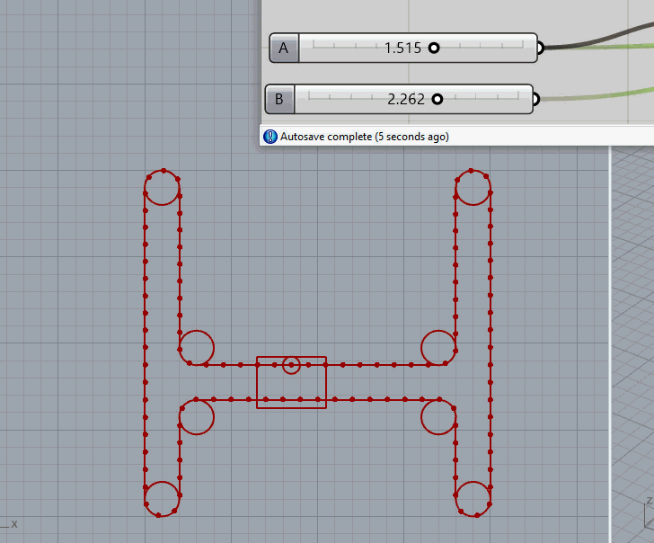

## Overview
**The below animation credits to: Bruce Shaprio @ https://discourse.mcneel.com/t/h-bot-simulation/127563**

This animation is called an H bot, and is a way of creating a 2D translator. It is perfect for our application, as it does not move any heavy electronics thus allowing for extremely fast movements. The motors that run the machine remain stationary.

### Pros and Cons of an H Bot

#### Pros
- **Speed**: Since the motors remain stationary, the system can achieve very high speeds.
- **Simplicity**: The design is relatively simple and easy to implement.
- **Cost-Effective**: Fewer moving parts can lead to lower costs in both manufacturing and maintenance.
- **Precision**: The fixed motors can provide high precision in movements.

#### Cons
- **Belt Tension**: Maintaining proper belt tension can be challenging and is crucial for accurate movements.
- **Cost**: The cost of the machine can be significant as all of the parts are highly reliant on one another to fit properly and work cohesively.
- **Wear and Tear**: The belts and pulleys are subject to wear and tear, which can affect long-term reliability.
- **Complex Calibration**: Initial setup and calibration can be complex and time-consuming.