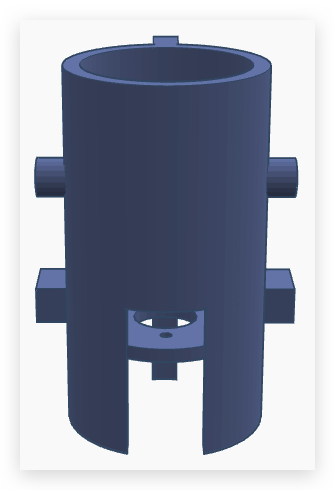

## Overview

The motor cage is designed to securely hold the motors, ensuring proper alignment and reducing vibrations during operation. The design needs to be lightweight, durable, and easy to install.

## Considerations

When designing the motor cage, we considered the following factors:  

1. **Stability**: The cage must hold the motors tightly without shifting during movement.  
2. **Ease of Assembly**: The design should allow for easy installation and removal of the motors.  
3. **Strength**: The cage needs to withstand repeated motion without breaking or deforming.  

## Design Iterations  

### **Initial Concept**  
The first design was a simple cylinder frame, molded around the motor, allowing for an easy press-fit. The motor was meant to slide in and be held.  

**Challenges:**  
- The motor could be too loose or too tight due to 3D printing tolerances, material shrinkage, and slight size variations between the digital model and the final print.
- Difficult to align the motor perfectly.  
- Taking the motor out would be annoying.  

### **Revisions & Testing**  
To solve the alignment and fitting issues, we switched to a loose **press-fit design** combined with **side screws** to tighten the motor from both sides.  

Changes made:  
- Made adjustments to the cylinder size allowing for at least 2mm of room around the motor.  
- Placed screw holes on the sides to clamp the motor in place.  
- Added a gap in the bottom part that holds the motor up, allowing for easy screwing and installation with the guide rail system.  
- Added corner gussets to increase stability and strength when connected to the guide rail system.

## Unexpected Roadblocks  

Printing this thing has been **way harder than expected**. Supports **aren’t actually supporting**, overhangs are failing, and **dimensions keep shifting slightly** between prints. We’ve been trying different techniques, including:  

- **Changing support types** (tree supports, regular supports, custom-designed ones).  
- **Adjusting print orientation** to avoid unsupported areas.  
- **Tweaking layer height and print speed** for better accuracy.  

It’s been a process of trial and error, but each failed print is helping refine the design and print strategy.  

## Material Selection  

### **Option 1: PLA+**  
- **Pros:** Cheap, easy to print, good strength.  
- **Cons:** Brittle under repeated stress.  

### **Option 2: PETG**  
- **Pros:** Flexible, stronger than PLA+, less brittle.  
- **Cons:** Harder to print, slightly more expensive.  

**Final Decision:**  
We chose **PLA+** because it was the cheapest option and initial tests showed it was strong enough for the job. If the cage breaks during testing, we'll switch to PETG.  

## Final Thoughts  
The final design uses a combination of **press-fit slots** and **side screws** to keep the motor secure while making installation easier. Next steps will be testing the part under real conditions and tweaking the design if any issues come up.