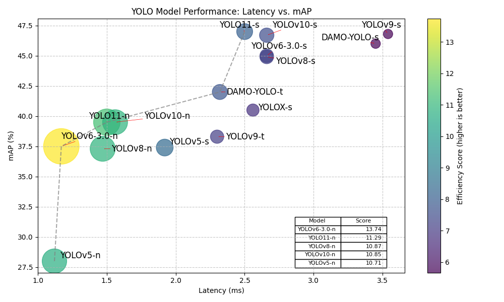

## Objectives

Whiplash is built on the basis of inhuman precision - performance is our top priority. Choosing the right model through research and testing is key to keeping latency low, accuracy high, and computational costs reasonable.

_Every millisecond matters, and every missed flick is a failure._

### Benchmarks

We've set the following performance standards to aim for:

- Computational effiency: >120 FPS on a RTX 3060 or equivalent GPU without major CPU bottlenecks
- Accuracy: At least 90% precision in target acquisition
- Response time: less than 50ms latency from target detection to servo actuation

### Roadmap

We'll start by leveraging pre-trained models from the You Only Look Once (YOLO) family, assessing their viability in real-time scenarios, as it's been deployed in many real-time critical industrial use cases already. If these models either fall short of our performance benchmarks or, conversely, prove effective but leave room for further optimization, we'll pivot to training our own CNN - either as a last resort or as an experiment to push Whiplash's capabilities even further.

---

## YOLO family

### Model Comparison

  An efficiency score is calculated from the latency and mAP values of each
  model  
  Latency: 0.7, mAP: 0.3

| **Model**   | **Release** | **Notes**                                                  | **Exp. Latency (ms)** | **Exp. Speed (FPS)** | **Exp. Accuracy (mAP)** |
| ----------- | ----------- | ---------------------------------------------------------- | --------------------- | -------------------- | ----------------------- |
| YOLO11n     | Mar 2024    | Nano variant, newest architecture                          | 1.5                   | 667                  | 39.5                    |
| YOLO11s     | Mar 2024    | Small variant with improved accuracy                       | 2.5                   | 400                  | 47.0                    |
| YOLOv10n    | May 2024    | Nano version by Tsinghua University, optimized for speed   | 1.56                  | 641                  | 39.5                    |
| YOLOv10s    | May 2024    | Small version with better accuracy                         | 2.66                  | 376                  | 46.7                    |
| YOLOv9t     | Feb 2024    | Tiny version with transformer elements                     | 2.3                   | 435                  | 38.3                    |
| YOLOv9s     | Feb 2024    | Small version with GELAN architecture                      | 3.54                  | 282                  | 46.8                    |
| YOLOv8n     | Jan 2023    | Nano model, offers good balance between accuracy and speed | 1.47                  | 680                  | 37.3                    |
| YOLOv8s     | Jan 2023    | Small variant                                              | 2.66                  | 376                  | 44.9                    |
| YOLOv6-3.0n | Oct 2022    | Industrial-grade nano model by Meituan                     | 1.17                  | 855                  | 37.5                    |
| YOLOv6-3.0s | Oct 2022    | Industrial-grade small model                               | 2.66                  | 376                  | 45.0                    |
| YOLOv5n     | Jun 2020    | Designed for real-time, widely adopted                     | 1.12                  | 893                  | 28.0                    |
| YOLOv5s     | Jun 2020    | Small variant                                              | 1.92                  | 521                  | 37.4                    |
| DAMO-YOLO-t | Dec 2022    | Alibaba's tiny model                                       | 2.32                  | 431                  | 42.0                    |
| DAMO-YOLO-s | Dec 2022    | Alibaba's small model                                      | 3.45                  | 290                  | 46.0                    |
| YOLOX-s     | Jul 2021    | An anchor-free version of YOLO                             | 2.56                  | 391                  | 40.5                    |

  <a
    className="text-muted-foreground text-sm"
    href="https://docs.ultralytics.com/modes/benchmark/#benchmark-visualization"
  >
    Source
  </a>

### Models Included in Testing

We'll be testing all of the models that fit the Pareto Frontier, as well as the models that have a latency below 2.0 ms.

This narrows our models down to a set of 7 we'll be testing with:

- **YOLO11n**
- **YOLO11-s**
- **YOLOv10n**
- **YOLOv8n**
- **YOLOv6-3.0n**
- **YOLOv5n**
- **DAMO-YOLO-t**
